## Project: 3D Perception 

---

### **3D Perception pipeline**

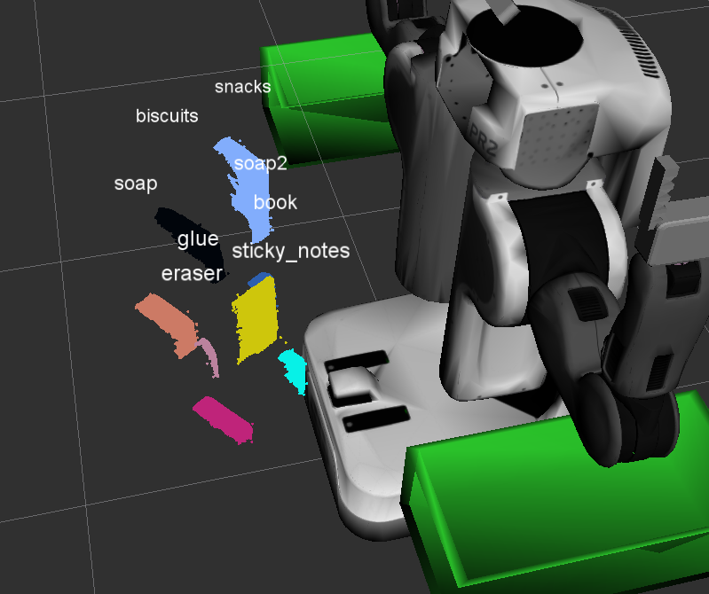

Re-implementing code covered in Exercises 1 to 3 was straightforward.
```
pcl_data = ros_to_pcl(pcl_msg)
```

After inspecting the world point cloud data, one could see that world-2 and world-3 contained some noise, which was not the case during the exercises.

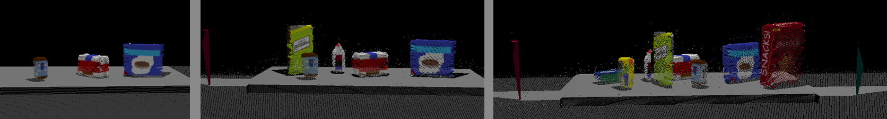

Applied the snippet from Lesson 17:

```
# [START Statistical outlier filter]
fil = pcl_data.make_statistical_outlier_filter()
fil.set_mean_k(5)
fil.set_std_dev_mul_thresh(0.5)

cloud_filtered = fil.filter()
# [END Statistical outlier filter]
```

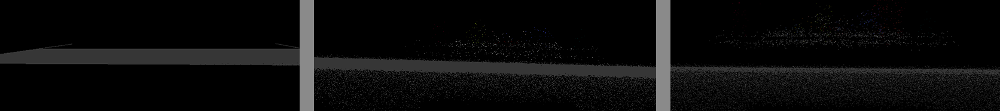

Some noise obviously was removed, but some still remains.

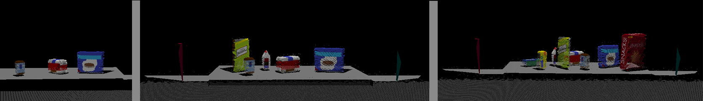

<sub> In hindsight the parameters here could have been finetuned to further reduce the noise, but didn't think it would become problematic further down the line, so I moved on.</sub>

```
# [START Plane fitting]
vox = cloud_filtered.make_voxel_grid_filter()

# downsample point cloud
leaf_size = 0.0028
vox.set_leaf_size(leaf_size, leaf_size, leaf_size)
cloud_filtered = vox.filter()
```
I tried to minimize the leaf_size as much as I could without having the warning appear that the leaf size was too small. This way hoped to keep the resolution on the high side.
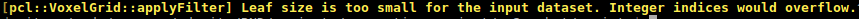

Getting rid of that table with a passthrough filter on Z-axis, just like during the exercise.

```
# passthrough filter
passthrough = cloud_filtered.make_passthrough_filter()
filter_axis = 'z'
passthrough.set_filter_field_name(filter_axis)
axis_min = 0.6
axis_max = 1.1
passthrough.set_filter_limits(axis_min, axis_max)
cloud_filtered = passthrough.filter()

```

The viewport also contained clipped edges from the boxes, those needed to be removed. Filtering in the same manner, this time on Y-axis. Had to play around with the axis min/max values to get the desired result.

```
# lets get rid of those boxes
passthrough = cloud_filtered.make_passthrough_filter()
filter_axis = 'y'
passthrough.set_filter_field_name(filter_axis)
axis_min = -0.45
axis_max = 0.45
passthrough.set_filter_limits(axis_min, axis_max)
cloud_filtered = passthrough.filter()

# [END Plane fitting]
```

Segmentation. Same as in the exercise.

```
# [START Segmentation]
seg = cloud_filtered.make_segmenter()
seg.set_model_type(pcl.SACMODEL_PLANE)
seg.set_method_type(pcl.SAC_RANSAC)
max_distance = 0.01
seg.set_distance_threshold(max_distance)
inliers, coefficients = seg.segment()

extracted_inliers = cloud_filtered.extract(inliers, negative=False)
extracted_outliers = cloud_filtered.extract(inliers, negative=True)
# [END Segmentation]
```
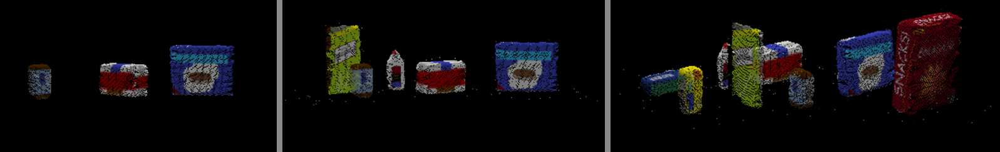

Clustering. The only difference from the exercise was to adjust the clustering parameters , to account for the small `leaf_size`, and not to exclude any objects.

```
# [START Clustering]
white_cloud = XYZRGB_to_XYZ(extracted_outliers)
tree = white_cloud.make_kdtree()
ec = white_cloud.make_EuclideanClusterExtraction()
ec.set_ClusterTolerance(0.03)
ec.set_MinClusterSize(100)
ec.set_MaxClusterSize(10000)
ec.set_SearchMethod(tree) # search the k-d tree for clusters
cluster_indices = ec.Extract()

get_color_list.color_list = []
cluster_color = get_color_list(len(cluster_indices))
color_cluster_point_list = []
for j, indices in enumerate(cluster_indices):
    for i, indice in enumerate(indices):
        color_cluster_point_list.append([
            white_cloud[indice][0],
            white_cloud[indice][1],
            white_cloud[indice][2],
            rgb_to_float(cluster_color[j])
        ])

cluster_cloud = pcl.PointCloud_PointXYZRGB()
cluster_cloud.from_list(color_cluster_point_list)
# [END Clustering]
```

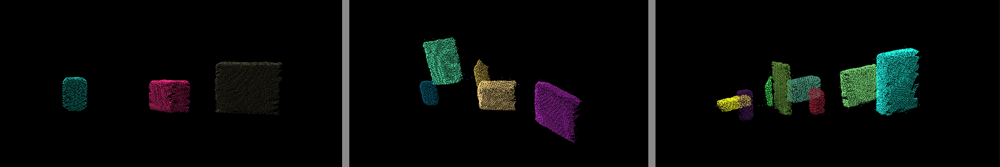

---

### **Extracting features and training SVM**
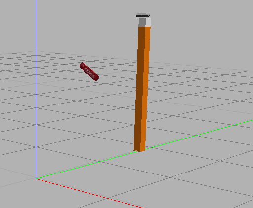

- [features.py](./features.py)
- [capture_feautres.py](./capture_features.py)
- [train_svm.py](./train_svm.py)

The implementation process was the same as in the exercise. Besides making sure to use HSV instead of RGB. `chists = compute_color_histograms(ros_cluster, using_hsv=True)` , the key differences / parameters that seemingly worked for all three datasets:

- 75 samples per item 
- bin size of 128 for colors
- bin size of 32 for normals
- LinearSVC classifier `clf = svm.LinearSVC()`

An increase in bin size for colors vs normals seemed to prioritize one over another for the recognition process, but this is just a "feeling", one would have to actually explore this further to see if the correlation is there.

The accuracy on average was around 0.90, deemed satisfactory.
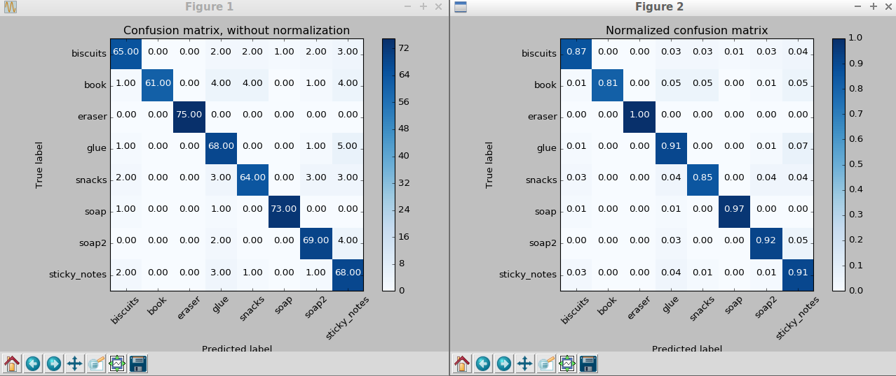
<sub> Sidenote - took me a couple hours to figure out a problem after having high accuracy in confusion matrices, yet in RVIZ the results were way off, classifying half of the items as biscuits. Turns out I was extracting the features with `catkin_ws/src/sensor_stick` code, which was still using RGB, all the time thinking I had symlinked the corrected project files... </sub>

the trained classifier appeared to work just as well in RVIZ:
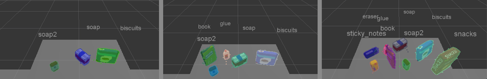

---

### **Writing .yaml files**

To save PickPlace requests into output_{1,2,3}.yaml files, I followed the process outlined in the project description. 

```
def pr2_mover(object_list):

    # TODO: Initialize variables
    test_scene = Int32()
    object_name = String()
    arm_name = String()
    pick_pose = Pose()
    place_pose = Pose()

    # Should be changed depending on the pick_list value in launch file
    # /pr2_robot/launch/pick_place_project.launch
    scene_num = "2"
    test_scene.data = scene_num 

    object_list_param = rospy.get_param('/object_list')

    dropbox = rospy.get_param('/dropbox')
    dropbox_groups = {}
    for box in dropbox:
        dropbox_groups[box['group']] = {"name": box['name'],
                                        "pose": box['position']}
    yaml_dicts = []

    for i in range(len(object_list_param)):
        name = object_list_param[i]['name']
        group = object_list_param[i]['group']

        for obj in object_list:
            if name == str(obj.label):

                object_name.data = name

                # TODO: Get the PointCloud for a given object and obtain it's centroid
                points_arr = ros_to_pcl(obj.cloud).to_array()
		x,y,z = np.mean(points_arr, axis=0)[:3]
                pick_pose.position.x = np.asscalar(x)
                pick_pose.position.y = np.asscalar(y)
                pick_pose.position.z = np.asscalar(z)

                # TODO: Create 'place_pose' for the object
		x,y,z = dropbox_groups[group]["pose"]
                place_pose.position.x = np.float(x)
                place_pose.position.y = np.float(y)
                place_pose.position.z = np.float(z)

                # TODO: Assign the arm to be used for pick_place
                arm_name.data = dropbox_groups[group]["name"]

                # TODO: Create a list of dictionaries (made with make_yaml_dict()) for later output to yaml format
                yaml_dicts.append(make_yaml_dict(test_scene, arm_name, object_name, pick_pose, place_pose))

    filename = "output_" + scene_num + ".yaml"
    send_to_yaml(filename, yaml_dicts)
```
<sub>If one were to continue the project, doing the pick-and-place part, the logic above would probably have to be adjusted to account for the possibilities of item count/arrangement changing on the table.</sub>

- [output_1.yaml](./output_1.yaml)
- [output_2.yaml](./output_2.yaml)
- [output_3.yaml](./output_3.yaml)

While the property order in output .yaml files was not the same as in output.yaml file from `config` folder, no items or properties were missing.

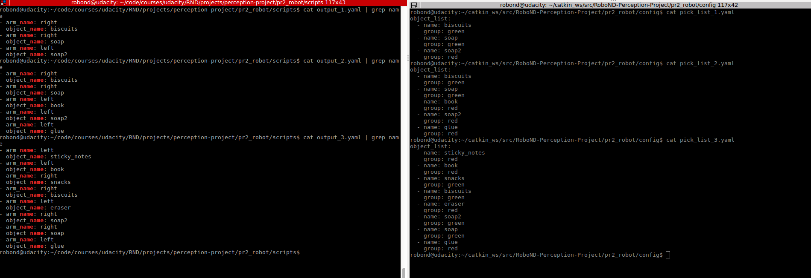


