## Project: Kinematics Pick & Place

**Steps to complete the project:**  

1. Set up your ROS Workspace. 
2. Download or clone the [project repository](https://github.com/udacity/RoboND-Kinematics-Project) into the ***src*** directory of your ROS Workspace. 
3. Experiment with the forward_kinematics environment and get familiar with the robot. 
4. Launch in [demo mode](https://classroom.udacity.com/nanodegrees/nd209/parts/7b2fd2d7-e181-401e-977a-6158c77bf816/modules/8855de3f-2897-46c3-a805-628b5ecf045b/lessons/91d017b1-4493-4522-ad52-04a74a01094c/concepts/ae64bb91-e8c4-44c9-adbe-798e8f688193). 
5. Perform Kinematic Analysis for the robot following the [project rubric](https://review.udacity.com/#!/rubrics/972/view) 
6. Fill in the `IK_server.py` with your Inverse Kinematics code. 


---

## **Kinematic Analysis**

**KUKA KR210**

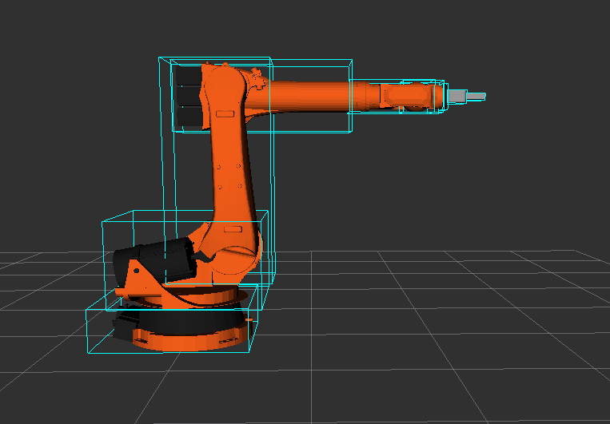
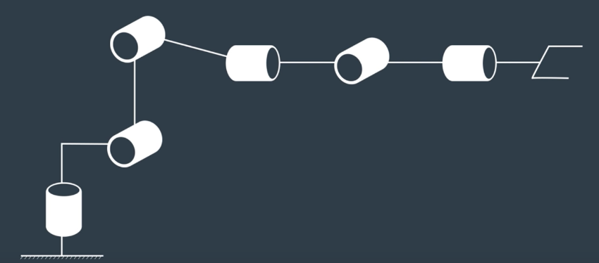

### **Forward kinematics**

#### Denavit-Hartenberg Parameters

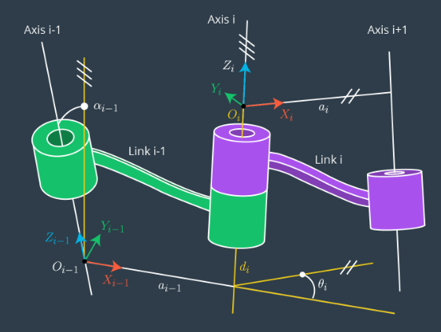

The convention used, as per lesson, John J Craig's (2005); parameters:

- $\alpha_{i-1}$ (twist angle) is angle between $\hat{Z}_{i-1}$ and $\hat{Z}_i$  measured about $\hat{X}_{i-1}$ in a right-hand sense.
- $a_{i-1}$ (link length) is distance from $\hat{Z}_{i-1}$ to $\hat{Z}_i$ measured along $\hat{X}_{i-1}$ where $\hat{X}_{i-1}$ is perpendicular to both $\hat{Z}_{i-1}$ and $\hat{Z}_i$
- $d_i$ (link offset) is signed distance from $\hat{X}_{i-1}$ to $\hat{X}_i$ measured along $\hat{Z}_i$. 
- $\theta_i$ (joint angle) is angle between $\hat{X}_{i-1}$ to $\hat{X}_i$ measured about $\hat{Z}_i$ in a right-hand sense. 


URDF file (KR210.urdf.xarco), 6 revolute joints with their parameters:

```
  <joint name="fixed_base_joint" type="fixed">
    <origin xyz="0 0 0" rpy="0 0 0"/>
    ...
  <joint name="joint_1" type="revolute">
    <origin xyz="0 0 0.33" rpy="0 0 0"/>
    <axis xyz="0 0 1"/>
    <limit lower="${-185*deg}" upper="${185*deg}" effort="300" velocity="${123*deg}"/>
    ...
  <joint name="joint_2" type="revolute">
    <origin xyz="0.35 0 0.42" rpy="0 0 0"/>
    <axis xyz="0 1 0"/>
    <limit lower="${-45*deg}" upper="${85*deg}" effort="300" velocity="${115*deg}"/>
    ...
  <joint name="joint_3" type="revolute">
    <origin xyz="0 0 1.25" rpy="0 0 0"/>
    <axis xyz="0 1 0"/>
    <limit lower="${-210*deg}" upper="${(155-90)*deg}" effort="300" velocity="${112*deg}"/>
    ...
  <joint name="joint_4" type="revolute">
    <origin xyz="0.96 0 -0.054" rpy="0 0 0"/>
    <axis xyz="1 0 0"/>
    <limit lower="${-350*deg}" upper="${350*deg}" effort="300" velocity="${179*deg}"/>
    ...
  <joint name="joint_5" type="revolute">
    <origin xyz="0.54 0 0" rpy="0 0 0"/>
    <axis xyz="0 1 0"/>
    <limit lower="${-125*deg}" upper="${125*deg}" effort="300" velocity="${172*deg}"/>
    ...
  <joint name="joint_6" type="revolute">
    <origin xyz="0.193 0 0" rpy="0 0 0"/>
    <axis xyz="1 0 0"/>
    <limit lower="${-350*deg}" upper="${350*deg}" effort="300" velocity="${219*deg}"/>
    ...
```

Following the [DH Parameter Assignment Algorithm](https://classroom.udacity.com/nanodegrees/nd209/parts/c199593e-1e9a-4830-8e29-2c86f70f489e/modules/8855de3f-2897-46c3-a805-628b5ecf045b/lessons/87c52cd9-09ba-4414-bc30-24ae18277d24/concepts/2f59c902-9c32-4b26-9e52-5e495ec14dba), to derive the DH parameters:

1. Label all joints from {1, 2, ..., n}.
2. Label all links from {0, 1, ..., n}, with fixed base link as 0.
3. Draw lines through all joints, defining the joint axes.
4. Assign the Z-axis of each frame to point along its joint axis.
5. Identify the common normal between each frame $\hat{Z}_{i-1}$ and frame $\hat{Z}_i$.

6. The endpoints of intermediate links are associated with two joint axes, {i} and {i+1}. For {i} from 1 to {n-1} assign the $\hat{X}_i$ to be:
  - For skew axes, along the normal between $\hat{Z}_i$ and $\hat{Z}_{i+1}$ and pointing from {i} to {i+1}
  - For intersecting axes, normal to the plain containing $\hat{Z}_i$ and $\hat{Z}_{i+1}$
  - For parallel or coincident axes, the assignment is arbitrary; look for ways to make other DH parameters equal to zero.
7. For base link, always choose frame {0} to be coincident with frame {1} when the first joint variable ($\theta_1$ or $d_1$) is equal to zero. This will guarantee that $\alpha_0$ = $a_0$ = 0, and, if joint 1 is a revolute, $d_1$ = 0. If joint 1 is prismatic, then $\theta_1$ = 0.
8. For the end effector frame, if joint *n* is revolute, choose $X_n$ to be in the direction of $X_{n-1}$ when $\theta_n$ = 0 and the origin of frame {n} such that $d_n$ = 0.


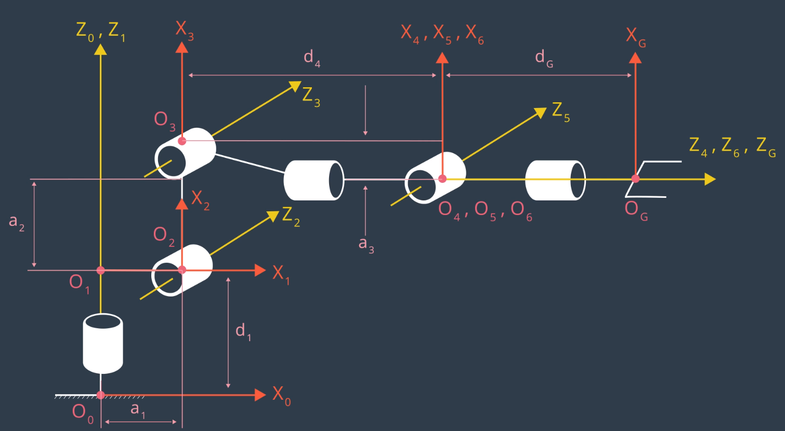

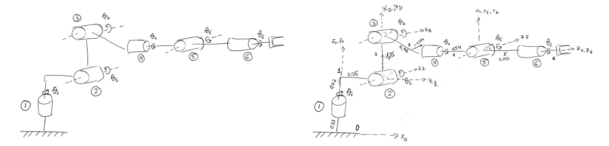

**DH Parameter table**

i | $\alpha_{i-1}$ | $a_{i-1}$ | $d_i$ | $\theta_i$
--- | --- | --- | --- | ---
0->1 | 0 | 0 | L1 | qi
... | ... | ... | ... | ...
6->G | 0 | 0 | 0 | 0

As all the joints are revolute, the only variable parameter will be the $\theta_i$.  
The numerical values for the a's and d's comes from the values in the URDF file.  
Note that reference frame assignments in URDF file do not match with reference frames defined in the DH parameters.  

Joint | x | y | z
--- | --- | --- | ---
J1 | 0 | 0 | 0.33
J2 | 0.35 | 0 | 0.42
J3 | 0 | 0 | 1.25
J4 | 0.96 | 0 | -0.054
J5 | 0.54 | 0 | 0
J6 | 0.193 | 0 | 0
G(EE) | 0.11 | 0 | 0
Total: | **2.153** | 0 | **1.946**
<sub>*Each joint is defined relative to its parent.*</sub>

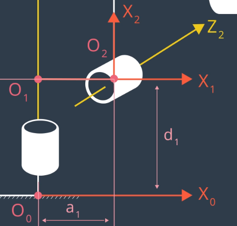

For joint_2, because the robot is drawn with all joint angles assumed 0, there is a -90 degree constant offset between $X_1$ and $X_2$.

i | $\alpha_{i-1}$ | $a_{i-1}$ | $d_i$ | $\theta_i$
--- | --- | --- | --- | ---
1 | 0 | 0 | 0.75 | $q_1$
2 | $-90^{\circ}$ | 0.35 | 0 | $q_2$ $-90^{\circ}$

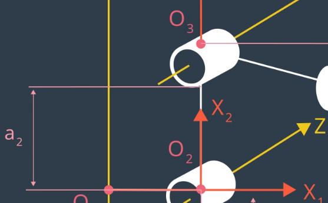

i | $\alpha_{i-1}$ | $a_{i-1}$ | $d_i$ | $\theta_i$
--- | --- | --- | --- | ---
3 | 0 | 1.25 | 0 | $q_3$

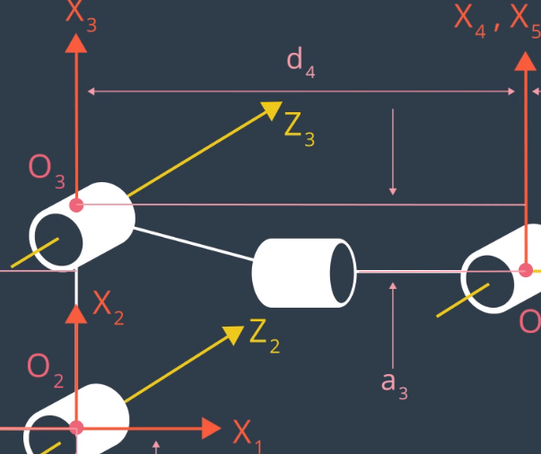

i | $\alpha_{i-1}$ | $a_{i-1}$ | $d_i$ | $\theta_i$
--- | --- | --- | --- | ---
4 | $-90^{\circ}$ | -0.054 | 1.5 | $q_4$

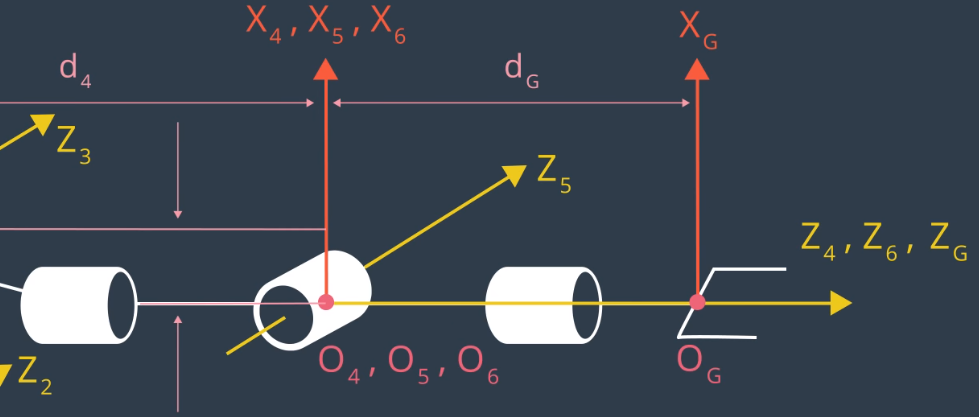

i | $\alpha_{i-1}$ | $a_{i-1}$ | $d_i$ | $\theta_i$
--- | --- | --- | --- | ---
5 | $90^{\circ}$ | 0 | 0 | $q_5$
6 | $-90^{\circ}$ | 0 | 0 | $q_6$
G | 0 | 0 | 0.303 | 0

#### Homogenous transforms

i | $\alpha_{i-1}$ | $a_{i-1}$ | $d_i$ | $\theta_i$
--- | --- | --- | --- | ---
1 | 0 | 0 | 0.75 | $q_1$
2 | $-90^{\circ}$ | 0.35 | 0 | $q_2$ $-90^{\circ}$
3 | 0 | 1.25 | 0 | $q_3$
4 | $-90^{\circ}$ | -0.054 | 1.5 | $q_4$
5 | $90^{\circ}$ | 0 | 0 | $q_5$
6 | $-90^{\circ}$ | 0 | 0 | $q_6$
G | 0 | 0 | 0.303 | 0

Using Python Sympy library to create individual transformation matrices

````
from sympy import symbols, cos, sin, pi, simplify, sqrt, atan2
from sympy.matrices import Matrix
from numpy import array

import numpy as np

# Create symbols for joint variables
alpha0, alpha1, alpha2, alpha3, alpha4, alpha5, alpha6 = symbols('alpha0:7')
a0, a1, a2, a3, a4, a5, a6 = symbols('a0:7')
d1, d2, d3, d4, d5, d6, d7 = symbols('d1:8')
q1, q2, q3, q4, q5, q6, q7 = symbols('q1:8')

# Conversion factors
rtd = 180./np.pi # radians to degrees
dtr = np.pi/180 # degrees to radians

# DH parameter table
DH_table = {alpha0:      0, a0:     0, d1: 0.75, q1:        q1
            alpha1:-90*dtr, a1:  0.35, d2:    0, q2:q2-90*dtr,
            alpha2:      0, a2:  1.25, d3:     0,q3:        q3
            alpha3:-90*dtr, a3:-0.054, d4: 1.50, q4:        q4
            alpha4: 90*dtr, a4:     0, d5:    0, q5:        q5
            alpha5:-90*dtr, a5:     0, d6:    0, q6:        q6
            alpha6:      0, a6:     0, d7:0.303, q7:        0}
````

The homogeneous transform from frame *i-1* to *i* is constructed as a sequence of four basic transformations, two rotations and two translations as follows:

$$^{i-1}_{i}T = R_{X}(\alpha_{i-1})D_{X}(a_{i-1})R_{Z}(\theta_{i})D_{Z}(d_{i})$$

$$^{i-1}_{i}T = \left[
\begin{matrix}
c\theta_i & -s\theta_i & 0 & a_{i-1}\\
s\theta_{i}c\alpha_{i-1} & c\theta_{i}c\alpha_{i-1} & -s\alpha_{i-1} & -s\alpha_{i-1}d_i\\
s\theta_{i}s\alpha_{i-1} & c\theta_{i}s\alpha_{i-1} & c\alpha_{i-1} & c\alpha_{i-1}d_i\\
0 & 0 & 0 & 1\\
\end{matrix}
\right] $$


```
# Define transformation matrix from frame {i-1} to {i}
def TF_matrix(alpha, a, d, q):
    return Matrix([
                   [cos(q),          -sin(q),          0,            a],
        [sin(q)*cos(alpha),cos(q)*cos(alpha),-sin(alpha),-sin(alpha)*d],
        [sin(q)*sin(alpha),cos(q)*sin(alpha), cos(alpha), cos(alpha)*d],
                        [0,                0,          0,            1]
    ])
    
```

Each row in DH parameter table corresponds to the transformation from frame {i} to frame {i+1}.  

```
# Create individual transformation matrices
T0_1 = TF_matrix(alpha0, a0, d1, q1).subs(DH_table)
T1_2 = TF_matrix(alpha1, a1, d2, q2).subs(DH_table)
T2_3 = TF_matrix(alpha2, a2, d3, q3).subs(DH_table)
T3_4 = TF_matrix(alpha3, a3, d4, q4).subs(DH_table)
T4_5 = TF_matrix(alpha4, a4, d5, q5).subs(DH_table)
T5_6 = TF_matrix(alpha5, a5, d6, q6).subs(DH_table)
T6_G = TF_matrix(alpha6, a6, d7, q7).subs(DH_table)
```

$$ ^{0}_{N}T = ^{0}_{1}T ^{1}_{2}T^{2}_{3}T...^{N-1}_{N}T $$

```
T0_G = T0_1 * T1_2 * T3_4 * T4_5 * T5_6 * T6_G

```
See if the position of the gripper reference frame origin is consistent with cumulative displacements in the URDF file

```
print(T0_G.evalf(subs={q1:0, q2:0, q3:0, q4:0, q5:0, q6: 0, q7:0}))
```
$$
\left[
\begin{matrix}
        0 &    0 & 1.0 &  2.153 \\
        0 & -1.0 &   0 &      0 \\
        1.0 &    0 &   0 & 1.946  \\
        0 &    0 &   0 &   1.0  \\
\end{matrix}
\right]
$$  


---

### Inverse kinematics

KR210 being a manipulator with spherical wrist allows to kinematically decouple the position and orientation of the end effector, i.e. instead of solving twelve nonlinear equations simultaneously, we can solve two simpler problems first:
 - Inverse Position - the cartesian coordinates of the wrist center (controlled by first three joints of the KR210 manipulator)
 - Inverse Orientation - the composition of rotations to orient the end effector (controlled by the last three joints)

1. Calculate the location of the spherical wrist center (WC), i.e. point $O_4$, $O_5$ or $O_6$ in DH model (joint_5 being the wrist center), using the transformation matrix derived in the forward kinematics section based on end-effector pose. Define our homogeneous transform as 

$$
\left[
\begin{matrix}
l_x & m_x & n_x & p_x \\
l_y & m_y & n_y & p_y \\
l_z & m_z & n_z & p_z \\
0 & 0 & 0 & 1\\
\end{matrix}
\right]
$$

where l, m and n are orthonormal vectors representing the end-effector orientation along X,Y,Z axes of the local coordinate frame.  
Since n is the vector along the z-axis of the gripper_link:

$$
w_x = p_x - (d_6 + l) \cdot n_x \\
w_y = p_y - (d_6 + l) \cdot n_y \\
w_z = p_z - (d_6 + l) \cdot n_z \\
$$

where
- $p_x$ $p_y$ $p_z$ = end effector positions
- $w_x$ $w_y$ $w_z$ = wrist positions
- $d_6$ = from DH table
- $l$ = end-effector length (from URDF file)

There is a difference between the gripper reference frame in URDF vs DH parameters.

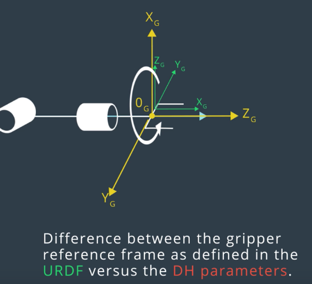  

To fix this (i.e. to get the frames to align), apply intrinsic (body-fixed) rotations to the gripper:
- 180 degrees about the z-axis
- and then -90 degrees about the y-axis.

```
# Correction to gripper link orientation URDF vs DH Convention
R_z = Matrix([
        [cos(np.pi), -sin(np.pi), 0, 0],
        [sin(np.pi), cos(np.pi), 0, 0],
        [0, 0, 1, 0],
        [0, 0, 0, 1]
        ])
R_y = Matrix([
         [cos(-np.pi/2),0,sin(-np.pi/2),0],
                     [0,1,            0,0],
        [-sin(-np.pi/2),0,cos(-np.pi/2),0],
                     [0,0,            0,1]
                     ])
R_corr = simplify(R_z * R_y)

T_total = simplify(T0_G * R_corr)


```

In order to calculate $n_x$ $n_y$ $n_z$, using correctional rotation matrix (for the difference between URDF and the DH reference frames for the end-effector), calculate EE pose with respect to base_link.
Using XYZ extrinsic rotations convention to transform from one fixed frame to other:

```
 Rrpy = Rot(Z, yaw) * Rot(Y, pitch) * Rot(X, roll) * R_corr
```

Roll, pitch and yaw angles are obtained from the simulation in ROS.

```
(roll, pitch, yaw) = tf.transformations.euler_from_quarternion([req.poses[x].orientation.x, req.poses[x].orientation.y,
                                                                req.poses[x].orientation.z, req.poses[x].orientation.w])
```

Extract $n_x$ $n_y$ and $n_z$ values from Rrpy matrix to obtain the wrist center position.

```
nx, ny, nz = Rrpy[:,2]
wx = px - (d6 + l) * nx
wy = py - (d6 + l) * ny
wz = pz - (d6 + l) * nz
```

Having the wrist center position, we need to solve for $\theta_1$, $\theta_2$ and $\theta_3$.

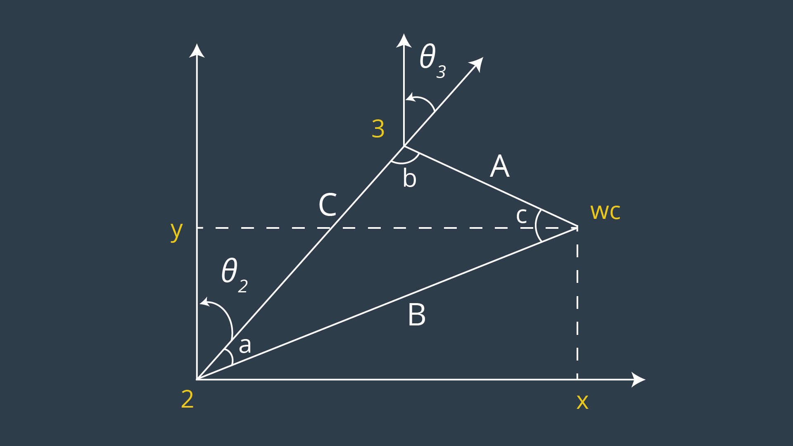

Knowing Law of Cosines was of importance here to get the angles $a$ $b$ and $c$ (pictured above)

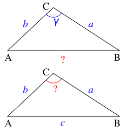

$$ \gamma = arccos({a^2 + b^2 - c^2} / {2ab}); $$

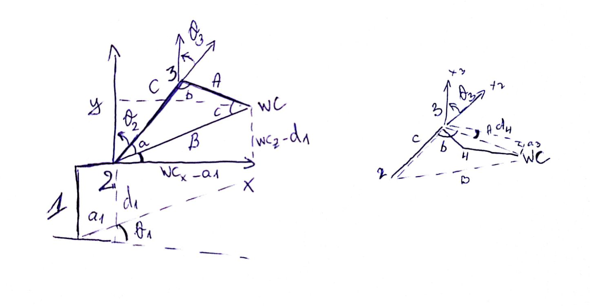

$$ \theta_1 = arctan(WC_y/WC_x) $$

```
theta1 = atan2(wy, wx)
```


$$ \theta_2 = pi/2 - a - arctan(WC_z - d_1/WC_x - a_1)$$

```
# using values from modified DH table
side_a = 1.501 # sqrt(a3^2 + d4^2)
side_b = sqrt(pow((sqrt(wx * wx + wy * wy) - 0.35), 2) + pow(wz - 0.75, 2)) # a1, d1
side_c = 1.25 # a2 

# Law of Cosines
angle_a = acos((side_b * side_b + side_c * side_c - side_a * side_a) / (2 * side_b * side_c))
angle_b = acos((side_a * side_a + side_c * side_c - side_b * side_b) / (2 * side_a * side_c))
angle_c = acos((side_a * side_a + side_b * side_b - side_c * side_c) / (2 * side_a * side_b))

# mind the offset
theta2 = pi/2 - angle_a - atan2(wz - 0.75, sqrt(wx * wx + wy * wy) - 0.35)
```


$$ \theta_3 = pi/2 - b - arctan(a_3/d_4) $$

```
theta3 = pi/2 - (angle_b + 0.036) # abs(a3/d4) * dtr
```


For the Inverse orientation problem, we need to find values of the final three joint variables.
Using individual DH transforms, we can obtain the resultant transform and hence resultant rotation by:

```
R0_6 = R0_1*R1_2*R2_3*R3_4*R4_5*R5_6
```

Since the overall RPY rotation between the base_link and gripper_link must be equal to the product of individual rotations between respective links, following holds true:
```
R0_6 = Rrpy
```
where Rrpy = Homogenous RPY rotation between base_link and gripper_link as calculated above.  

Substitute values calculated for joints 1 to 3 in their respective individual rotation matrices and pre-multiply both sides of the above equation by inv(R0_3) which leads to:

```
R3 = T0_3.evalf(subs={theta1:p1, theta2:p2, theta3:p3})
R3_6 = inv(R0_3) * Rrpy
```

For $\theta_4$, $\theta_5$, and $\theta_6$ following the process outlined in [Euler Angles from a Rotation Matrix](https://classroom.udacity.com/nanodegrees/nd209/parts/c199593e-1e9a-4830-8e29-2c86f70f489e/modules/8855de3f-2897-46c3-a805-628b5ecf045b/lessons/87c52cd9-09ba-4414-bc30-24ae18277d24/concepts/a124f98b-1ed5-45f5-b8eb-6c40958c1a6b)
$$
\beta = atan2(y,x) = atan2(-r_{31}, \sqrt{-r_{11}*r_{11}+r_{21}*r_{21}}) \\
\gamma = atan2(r_{32}, r_{33}) \\
\alpha = atan2(r_{21},r_{11}) \\
$$

```
theta4 = atan2(R3_6[2,2] -R3_6[0,2])
theta5 = atan2(sqrt(R3_6[0,2]*R3_6[0,2]+R3_6[2,2]*R3_6[2,2]),R3_6[1,2])
theta6 = atan2(-R3_6[1,1], R3_6[1,0])
```
---

## **Project Implementation**

The project implementation mostly follows filling what is already laid out above in the corresponding parts in IK_server.py. 
Using IK_debug.py to verify, results in a following output:

```
robond@udacity:~/catkin_ws/src/RoboND-Kinematics-Project$ ./IK_debug.py 

Total run time to calculate joint angles from pose is 0.5652 seconds

Wrist error for x position is: 0.00000046
Wrist error for y position is: 0.00000032
Wrist error for z position is: 0.00000545
Overall wrist offset is: 0.00000548 units

Theta 1 error is: 0.00093770
Theta 2 error is: 0.00181024
Theta 3 error is: 0.00205031
Theta 4 error is: 0.00172067
Theta 5 error is: 0.00197873
Theta 6 error is: 0.00251871

**These theta errors may not be a correct representation of your code, due to the fact            
that the arm can have muliple positions. It is best to add your forward kinmeatics to            
confirm whether your code is working or not**
 

End effector error for x position is: 0.00002010
End effector error for y position is: 0.00001531
End effector error for z position is: 0.00002660
Overall end effector offset is: 0.00003668 units 
```

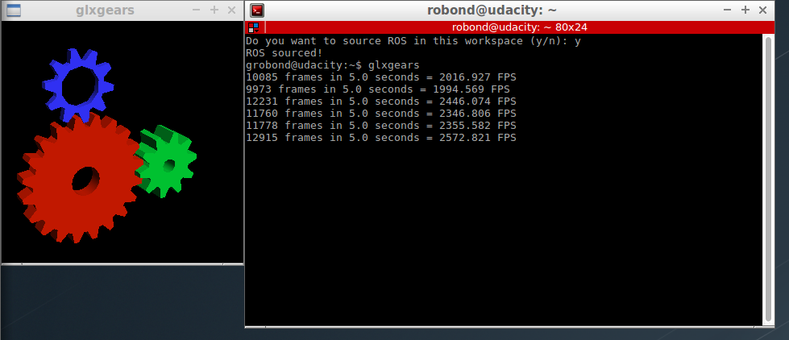
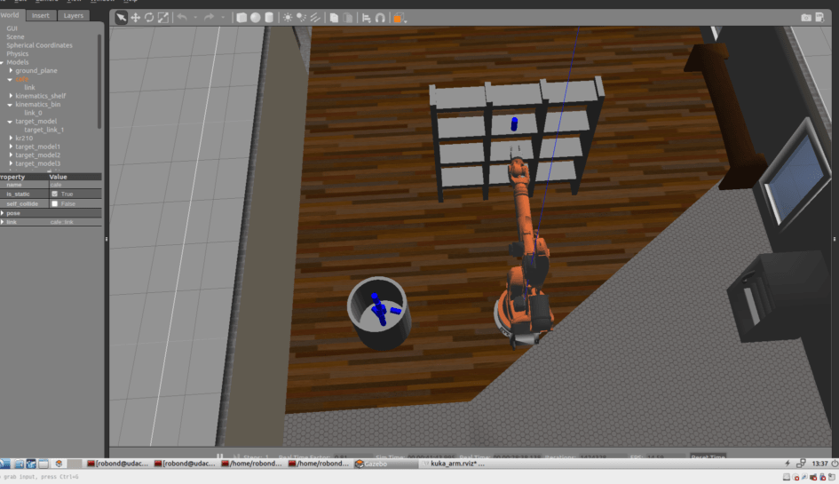
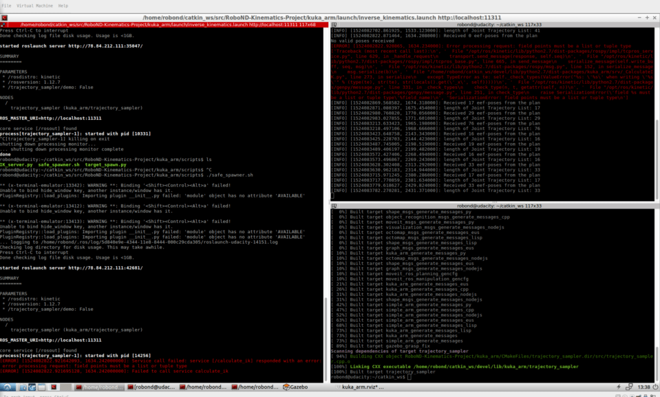

Running the IK_server and pick-and-place simulation, while the manipulator manages to pass the 8/10 successful pick-and-place operation requirement, it appears to be comparatively slow and making a lot of reduntant movements, especially rotations of the wrist. Further improvement would require considering ways to remedy those issues.

Also, as indicated in "Common Questions" section, I did find that it was neccessary to add an extra line in /src/trajectory_sampler.cpp
```
ros::Duration(2.0).sleep();
```
to give the arm an extra time to grasp the cylinder, otherwise it was the case that it did not grasp it in some cases.


