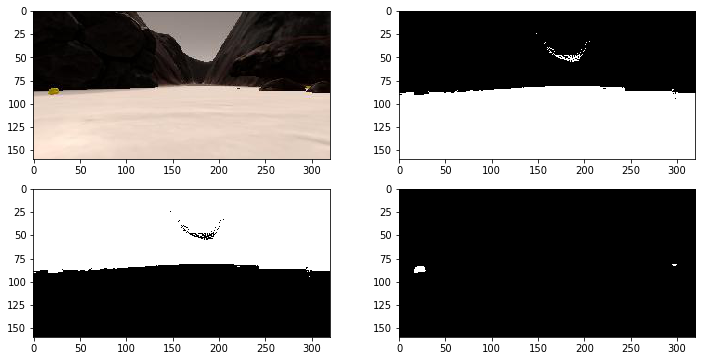
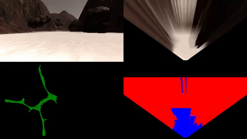
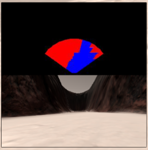
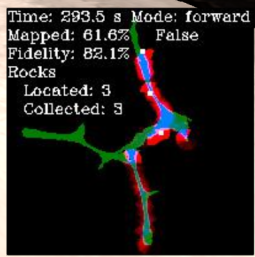
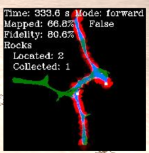
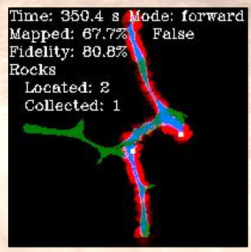
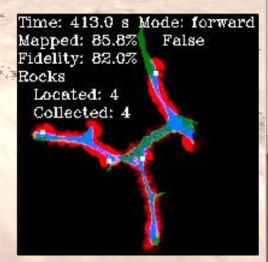
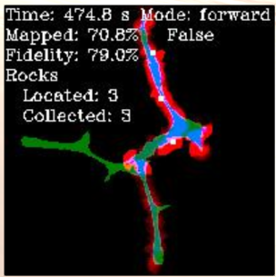
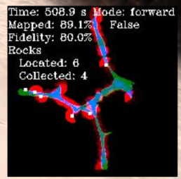
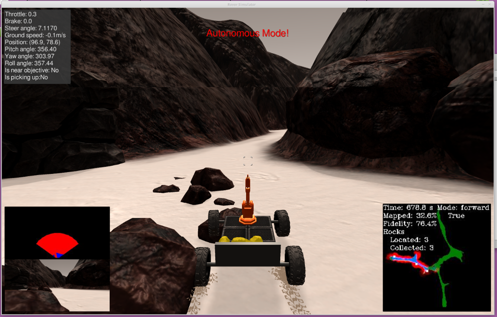

## Project: Search and Sample Return

### **The goals / steps performed:**

**Training / Calibration**
- [X] Download the simulator and take data in "Training mode"
- [X] Test out the functions in the Jupyter Notebook provided
- [X] Add functions to detect obstacles and samples of interest
- [X] Fill in the `process_image()` function with the appropriate image processing steps (perspective transfor, color threshold etc.) to get from raw images to a map. The `output_image` you create in this step should demonstrate that your mapping pipeline works.
- [X] Use `moviepy` to process the images in your saved dataset with the `process_image()` function. Include the video you produce as a part of your submission


**Autonomous Navigation / Mapping**

- [X] Fill in the `perception_step()` function within the `perception.py` script with the appropriate image processing functions to create a map and update `Rover()` data (similar to what you did with `process_image()` in the notebook). 
- [X] Fill in the `decision_step()` function within the `decision.py` script with conditional statements that take into consideration the outputs of the `perception_step()` in deciding how to issue throttle, brake and steering commands. 
- [X] Iterate on your perception and decision function until your rover does a reasonable (need to define metric) job of navigating and mapping.  

## [Rubric](https://review.udacity.com/#!/rubrics/916/view) Points
### Writeup / README

### Notebook Analysis
####  [X] 1. Run the functions provided in the notebook on test images (first with the test data provided, next on data you have recorded). Add/modify functions to allow for color selection of obstacles and rock samples.

Initially I modified color_thresh function, to be able to input a comparison operator, i.e. getting selection of terrain and obstacles differently. I ended up not using the operator argument for this submission, but it allows for more flexibility should I come back to try to improve the solution. Arguably this is writing code that is not needed.

```python
 def color_thresh(img, rgb_thresh=(160, 160, 160), cmp_op=operator.gt):
    # Single channel of img shaped zeros
    color_select = np.zeros_like(img[:,:,0])
    
    # separate channels
    img_r = img[:,:,0]
    img_g = img[:,:,1]
    img_b = img[:,:,2]
    
    r, g, b = rgb_thresh
    
    # Compare each pix to thresh
    thresh = (cmp_op(img_r, r) \
              & cmp_op(img_g, g) \
              & cmp_op(img_b, b))
        
    color_select[thresh] = 1
    
    return color_select
```

Following the hints/suggestions, I opted for OpenCV usage for sample detection (adapted from the [link provided](http://opencv-python-tutroals.readthedocs.io/en/latest/py_tutorials/py_imgproc/py_colorspaces/py_colorspaces.html)) and obstacles are just inverted terrain using bitwise XOR. 

```python
def color_thresh_terrain(img):
    return color_thresh(img, (160,160,160))

def color_thresh_obstacles(img):
    return color_thresh_terrain(img) ^ 1

def color_thresh_samples(img):
    hsv = cv2.cvtColor(img, cv2.COLOR_RGB2HSV)
    
    lower_yellow = np.array([20, 100, 100])
    upper_yellow = np.array([30, 255, 255])
    
    mask = cv2.inRange(hsv, lower_yellow, upper_yellow)
    
    return mask
```

Applying the color thresholding functions to a sample image, seems to output an acceptable result:



#### [X] 2. Populate the `process_image()` function with the appropriate analysis steps to map pixels identifying navigable terrain, obstacles and rock samples into a worldmap.  Run `process_image()` on your test data using the `moviepy` functions provided to create video output of your result. 

The `process_image()` function I modified accordingly:
- [X] 1) Define source and destination points for perspective transform. These were known from the lessons earlier.
```python
 # Define a calibration box in source (actual) and destination (desired) coordinates
    # The source and destination points are defined to warp the image to a grid
    # where each 10x10 pixel square represents 1 square meter
    # The destination box will be 2 * dst_size on each side
    dst_size = 5

    # Set a bottom offset - bottom offset is in front of the rover a bit
    bottom_offset = 5
    
    image = img
    source = np.float32([[14, 140], [301 ,140], [200, 96], [118, 96]])
    destination = np.float32([[image.shape[1]/2 - dst_size, image.shape[0] - bottom_offset],
                  [image.shape[1]/2 + dst_size, image.shape[0] - bottom_offset],
                  [image.shape[1]/2 + dst_size, image.shape[0] - 2*dst_size - bottom_offset], 
                  [image.shape[1]/2 - dst_size, image.shape[0] - 2*dst_size - bottom_offset],
                  ])
```
- [X] 2) Apply color threshold - I chose to do thresholding first, perspective transform afterwards.
```python
    terrain = color_thresh_terrain(img)
    obstacles = color_thresh_obstacles(img)
    samples = color_thresh_samples(img)
```
- [X] 3) Apply perspective transform using the functions defined earlier in the lesson.

```python
    warped_terrain = perspect_transform(terrain, source, destination)
    warped_obstacles = perspect_transform(obstacles, source, destination)
    warped_samples = perspect_transform(samples, source, destination)
```

- [X] 4) Converting thresholded image pixel values to rover-centric coords.

```python
    rover_centric_terrain = rover_coords(warped_terrain)
    rover_centric_obstacles = rover_coords(warped_obstacles)
    rover_centric_samples = rover_coords(warped_samples)
    
```

- [X] 5) Converting rover-centric pixel values to world coordinates. Defined a helper function, dry and all.

```python
    scale = 10
    # pix_to_world(xpix, ypix, xpos, ypos, yaw, world_size, scale)
    def px2world(rov_coords): 
        return pix_to_world(rov_coords[0], rov_coords[1], data.xpos[data.count], 
                                data.ypos[data.count], data.yaw[data.count], 
                                data.worldmap.shape[0], scale)
    world_terrain = px2world(rover_centric_terrain)
    world_obstacles = px2world(rover_centric_obstacles)
    world_samples = px2world(rover_centric_samples)
```
- [X] 6) Updating worldmap to be displayed on right side of screen. Updating terrain and obstacles, and samples, if we happen to have any. Code is mostly from the Walkthrough video, as I was struggling to get the samples right.

```python
    data.worldmap[world_obstacles[1], world_obstacles[0], 0] += 1
    data.worldmap[world_terrain[1], world_terrain[0], 2] += 10

    if samples.any():
        
        sample_dist, sample_angles = to_polar_coords(rover_centric_samples[0],
                                                     rover_centric_samples[1])
        sample_idx = np.argmin(sample_dist)
        sample_cX = world_samples[0][sample_idx]
        sample_cY = world_samples[1][sample_idx]
        
        data.worldmap[np.int_(sample_cY), np.int_(sample_cX), 1] = 255
```
- [X] 7) Make a mosaic image. The only thing I changed in provided code for this step was adding rover "vision" image to the lower right side of the screen as follows:

```python
    img_x = img.shape[0]
    img_y = img.shape[1]
    output_image[-img_x:, img_y:, 2] = warped_terrain * 255
    output_image[-img_x:, img_y:, 0] = warped_obstacles * 255
    output_image[-img_x:, img_y:, 1] = warped_samples * 255
```

Output file from recorded data:



## Autonomous Navigation and Mapping

#### [X] 1. Fill in the `perception_step()` (at the bottom of the `perception.py` script) and `decision_step()` (in `decision.py`) functions in the autonomous mapping scripts and an explanation is provided in the writeup of how and why these functions were modified as they were.

##### `perception.py`

The code in `perception_step()` follows the same sequence and code as in jupyter notebook (above), with the only difference of  getting the rover camera image, position and yaw angle, and updating Rover vision_image between steps:

```python
# Apply the above functions in succession and update the Rover state accordingly
def perception_step(Rover):

    # Get the current camera image
    img = Rover.img
    rover_x = Rover.pos[0]
    rover_y = Rover.pos[1]
    rover_yaw = Rover.yaw

    # 1) Define source and destination points for perspective transform
    # Source and destination points for perceptive transform
    # The destination box will be 2*dst_size on each side
    dst_size = 5

    # Bottom offset in front of the rover
    bottom_offset = 5

    source = np.float32([[14, 140], [301, 140], [200, 96], [118, 96]])
    destination = np.float32([[img.shape[1]/2 - dst_size, img.shape[0] - bottom_offset],
                              [img.shape[1]/2 + dst_size, img.shape[0] - bottom_offset],
                              [img.shape[1]/2 + dst_size, img.shape[0] - 2*dst_size - bottom_offset],
                              [img.shape[1]/2 - dst_size, img.shape[0] - 2*dst_size - bottom_offset],
                              ])

    # 2) Applying threshold before transform
    terrain = color_thresh_terrain(img)
    obstacles = color_thresh_terrain(img) ^ 1
    samples = color_thresh_samples(img)

    # 3) Apply perspective transform
    warped_terrain = perspect_transform(terrain, source, destination)
    warped_obstacles = perspect_transform(obstacles, source, destination)
    warped_samples = perspect_transform(samples, source, destination)

```

To improve the fidelity, I limited the range of obstacles and terrain by masking the perceived image with an ellipse-like mask. Could be a better way to do this. Defined a helper function in `perception.py`:

```python
def mask_image(img):
    # make the poor rover nearsighted
    image = np.zeros_like(img)
    radius = np.int32(img.shape[0] / 2)
    axes = (radius,radius)
    angle = 0;
    startAngle = 0;
    endAngle = -180;
    center_X = np.int32(img.shape[1] / 2)
    center_Y = np.int32(img.shape[0])
    center = (center_X, center_Y)
    color = 255
    mask = cv2.ellipse(image, center, axes, angle, startAngle, endAngle, color, -1)

    masked = cv2.bitwise_and(img, img, mask=mask)

    return masked
```
which is then used to mask the warped images of terrain and obstacles.

```python
    warped_terrain = mask_image(warped_terrain)
    warped_obstacles = mask_image(warped_obstacles)

    # 4) Update Rover.vision_image (left side of the screen)
    # e.g. Rover.vision_image[:,:,0]
    Rover.vision_image[:,:,0] = warped_obstacles * 255
    Rover.vision_image[:,:,2] = warped_terrain * 255
    Rover.vision_image[:,:,1] = warped_samples * 255

    # 5) Convert map image pixel values to rover-centric coords
    rover_centric_terrain = rover_coords(warped_terrain)
    rover_centric_obstacles = rover_coords(warped_obstacles)
    rover_centric_samples = rover_coords(warped_samples)

    # 6) Convert rover-centric pixel values to world coordinates
    scale = 2 * dst_size
    worldmap_size = Rover.worldmap.shape

    def px2world(xy):
        return pix_to_world(xy[0], xy[1], rover_x, rover_y, rover_yaw, worldmap_size[0], scale)

    world_terrain = px2world(rover_centric_terrain)
    world_obstacles = px2world(rover_centric_obstacles)
    world_samples = px2world(rover_centric_samples)
```

Following the hints, for increased fidelity, I defined an additional helper function `is_near_zero()` to determine whether the pitch and roll angles are near zero. Before updating the worldmap, we check whether both the roll and pitch angles are near zero, and rover is not picking up any samples. Otherwise we do not update the worldmap.

```python
    # 7) Update Rover worldmap (to be displayed on the right side of the screen)
    def is_near_zero(val, eps=0.5):
        return val < eps or abs(val-360.0) < eps

    if is_near_zero(Rover.pitch) and is_near_zero(Rover.roll) and not Rover.picking_up:
        Rover.worldmap[world_terrain[1], world_terrain[0], 2] += 10
        Rover.worldmap[world_obstacles[1], world_obstacles[0], 0] += 1
```

Additionally, I modified `RoverState()` class to record `sample_dists` and `sample_angles` for later use in `decision_step()`.

```python
    if samples.any():
        Rover.sample_dists, Rover.sample_angles = to_polar_coords(rover_centric_samples[0],
                                                     rover_centric_samples[1])
        if Rover.sample_dists.any():
            sample_idx = np.argmin(Rover.sample_dists)
            sample_cX = world_samples[0][sample_idx].astype(np.int)
            sample_cY = world_samples[1][sample_idx].astype(np.int)

            Rover.worldmap[sample_cY, sample_cX, 1] = 255
            Rover.vision_image[:, :, 1] = warped_samples * 255
    else:
        Rover.vision_image[:, :, 1] = 0
        Rover.sample_dists, Rover.sample_angles = np.array([]), np.array([])

    # 8) Convert rover-centric pixel positions to polar coordinates
    # Update Rover pixel distances and angles
    # Rover.nav_dists = rover_centric_pixel_distances
    # Rover.nav_angles = rover_centric_angles
    Rover.nav_dists, Rover.nav_angles = to_polar_coords(rover_centric_terrain[0],
                                                        rover_centric_terrain[1])


    return Rover
```

*Note, that the color thresholding function was changed the same way as in the notebook. The top part of perception.py up to `rover_coords()` function is as follows:*

```python
import numpy as np
import cv2
import operator

# Identify pixels above the threhold
# > 160 ok for ground pixels only
def color_thresh(img, rgb_thresh=(160,160,160), cmp_op=operator.gt):
    # Zeros size of img, but single channel
    color_select = np.zeros_like(img[:,:,0])

    img_r = img[:,:,0]
    img_g = img[:,:,1]
    img_b = img[:,:,2]

    r,g,b = rgb_thresh

    # Require each px to be above thresh val
    above_thresh = (cmp_op(img_r, r) \
                    & cmp_op(img_g, g) \
                    & cmp_op(img_b, b))

    color_select[above_thresh] = 1

    # Return the binary image
    return color_select

def color_thresh_terrain(img):
    return color_thresh(img, (160, 160, 160))

def color_thresh_samples(img):
    hsv = cv2.cvtColor(img, cv2.COLOR_RGB2HSV)

    lower_yellow = np.array([20, 100, 100])
    upper_yellow = np.array([30, 255, 255])

    mask = cv2.inRange(hsv, lower_yellow, upper_yellow)

    return mask
```


The rest of perception.py remains unchanged.


##### `decision.py`

With the functionality already given in the file, the Rover has two modes - 'stop' and 'forward'. 

```python
def decision_step(Rover):

    # Check for vision
    if Rover.nav_angles is not None:

        # Check for Rover.mode status
        if Rover.mode == 'forward':

        ...

        # If already in "stop" mode then make different decisions
        elif Rover.mode == 'stop':

        ...

    # Just to make the rover do something
    # even if no modifications have been made
    else:
        Rover.throttle = Rover.throttle_set
        Rover.steer = 0
        Rover.brake = 0
```

First, as the Rover was getting stuck frequently, we needed a way to get unstuck.
To check whether Rover is stuck, I decided to check its recent positions. Additional attributes to `RoverState` class:

```python
class RoverState():
    def __init__(self):
        ...
        self.log_len = 30
        self.pos_log = [0] * self.log_len   # Keep record of last positions
        ...
```

In 'forward' mode keep a log of positions and every n seconds check the distance traveled. If it is below threshold, enter 'stuck' mode.

```python
        # Keep a log to check if stuck
        total_time = np.int32(Rover.total_time)
        idx = ((total_time + 1) % Rover.log_len)
        prev_idx = idx - 1
        Rover.pos_log[idx] = np.asarray(Rover.pos)

        # Check every n seconds if we are moving
        if total_time % 2 == 0:
        if np.linalg.norm(Rover.pos_log[idx]-
                                Rover.pos_log[prev_idx]) < 0.01 and Rover.mode == 'forward':
                Rover.mode = 'stuck'
        else:
                Rover.mode = 'forward'
```

Once in 'stuck' mode, set the steering angle fully locked to the right (arbitrary), which effectively results in a slight nudge towards right. Resume forward mode, and see if that helped. If not, it will keep entering 'stuck' mode and repeating the nudge. More often than not, given a bit of time, this will get the rover unstuck.

```python
        elif Rover.mode == 'stuck':
                Rover.throttle = 0
                # Release brake to allow turning
                Rover.brake = 0
                # Turn range is +- 15 degrees, when stopped the next line will induce
                # 4-wheel turning
                Rover.steer = -15 # Could be more clever way about which way to turn
                # resume trying to go forward
                Rover.mode = 'forward'
```

Steering - needed an adjustment to steer towards a sample if we see one, and adjust throttle to be able to slow down in time (again, more often than not).

```python
        # Check if we see any samples
        if Rover.sample_angles.any():
        # Slow down
        Rover.brake = Rover.brake_set
        Rover.brake = 0
        Rover.throttle = Rover.throttle_set / 

        # If so, bias the steering angle towards the sample
        sample_angle = np.clip(np.mean(Rover.sample_angles*180/np.pi), -15, 15) * 0.7
        nav_angle = np.clip(np.mean(Rover.nav_angles*180/np.pi), -15, 15) * 0.3
        Rover.steer = sample_angle + nav_angle
```
otherwise, steer normally. My attempt at wall crawling was not that successful, probably with more trial and error a better way could be found. Note that I have added a `steering_bias` attribute to `RoverState` class.

```python
        else:
                # Otherwise set steering angle to average angle
                Rover.steer = np.clip(np.mean(Rover.nav_angles*180/np.pi), -15, 15)
                Rover.throttle = Rover.throttle_set

                # Bias the steering (attempt at wall crawling)
                bias = Rover.steering_bias

                if Rover.vel > 0.7 and Rover.vel < 1.0:
                bias = bias / Rover.vel
                if Rover.vel < 2.0 and Rover.vel >= 1.0:
                bias = Rover.steering_bias * 1.5
                else:
                bias = Rover.steering_bias

                Rover.steer = np.clip(Rover.steer + bias, -15, 15)
```

The final modification to 'forward' mode was to stop if Rover is near a sample. This, along with a modification below, allows the rover to initiate the pickup already defined in `driver_rover.py`

```python
        # If we are near a sample, stop
        if Rover.near_sample:
                Rover.brake = Rover.brake_set
                Rover.steer = 0
                Rover.mode = 'stop'
```

An adjustment to 'stop' mode was needed as well - do not switch to 'forward' mode if we are near a sample:

```python

        elif Rover.mode == 'stop':
        ...
                # If not moving (vel < 0.2) and not near a sample, then do something else
                elif Rover.vel <= 0.2 and not Rover.near_sample:
        ...
```

#### 2. Launching in autonomous mode your rover can navigate and map autonomously.  Explain your results and how you might improve them in your writeup.  

**Note: running the simulator with different choices of resolution and graphics quality may produce different results, particularly on different machines!  Make a note of your simulator settings (resolution and graphics quality set on launch) and frames per second (FPS output to terminal by `drive_rover.py`) in your writeup when you submit the project so your reviewer can reproduce your results.**

---

###### Graphic settings 

Screen resolution: 1680x1050

Graphics Quality: Good

Windowed: True

FPS output to terminal by `drive_rover.py`: 17-21

----

My approach was to follow the optimizing metrics provided (at least some of them) -
- Optimizing fidelity - visible (and consequently mapped) range for terrain and obstacles is clipped 

- Optimizing fidelity - No mapping is done during pick-up and when roll or yaw angles are above threshold.
- Optimizing for finding all rocks - Rover steering biased towards one wall, to make it wall-crawling -ish.


The end result is a basic solution, but more often than not it passes the requirements for a passing submission, given some time (> 400 s)








There are some cases when it can get stuck for a long periods of time between rocks, or spend some time running in circles in larger areas. To avoid those would require further improvements.



----

Improvement areas:
- Wall-crawling should be improved, probably a better, more consistent solution can be found via trial and error.
- Unstuck mode is primitive, could be smarter. There are cases where the rover cannot get unstuck with this approach alone, or at least it takes significant amount of time for the Rover to get unstuck.
- If Rover is crawling the wall on the left and it sees a sample on the right and goes to pick it up, afterwards it will most likely rotate to the right again, and effectively leave an area unexplored until it returns again at that point by crawling the left wall. Could either ignore the samples on the right side, or turn the opposite direction after sample pickup.
- Rover has no clue which areas it has visited before.
- Doesn't return to the starting point after sample pick-up, has no idea where the said point is. 

